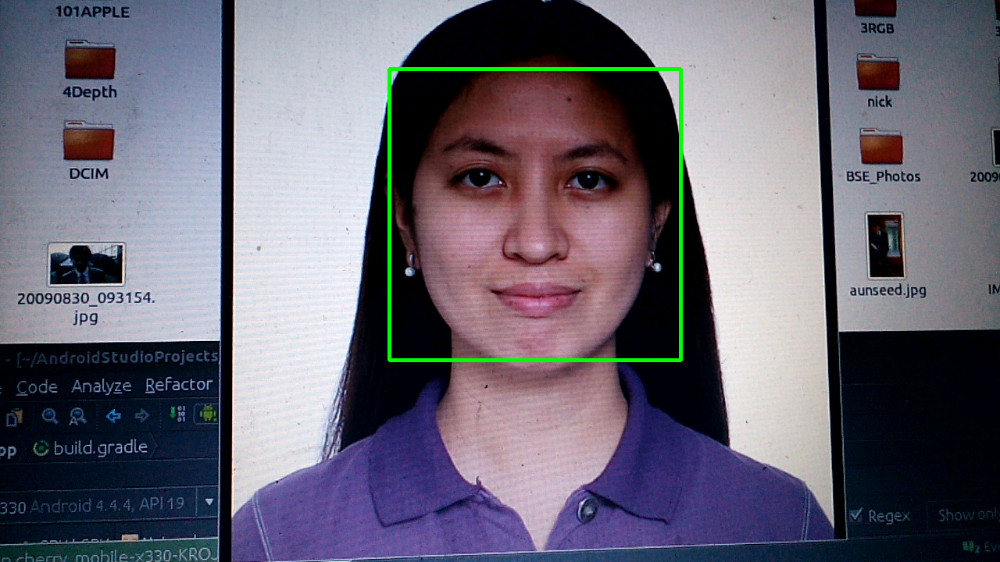

# Face Detection in OpenCV with Gradle Experimental Plugin


## Warning

 Note that this is plugin is at the experimental stage. The Gradle API for the new component model is not final, which means it'll only work with a specific version of Gradle until the APIs are final.

For issues, refer to:

(http://tools.android.com/tech-docs/new-build-system/gradle-experimental)

## Pre-requisites
--------------
- Android Studio 1.3+ with [NDK](https://developer.android.com/ndk/) bundle.
- [OpenCV](http://opencv.org)

## Keypoints:

'gradle-wrapper.properties' uses 'gradle-2.8'. 
```gradle
distributionBase=GRADLE_USER_HOME
distributionPath=wrapper/dists
zipStoreBase=GRADLE_USER_HOME
zipStorePath=wrapper/dists
distributionUrl=https\://services.gradle.org/distributions/gradle-2.8-all.zip
```

Project's 'build.gradle' uses 'gradle-experimental:0.4.0'. 
```gradle
// Top-level build file where you can add configuration options common to all sub-projects/modules.

buildscript {
    repositories {
        jcenter()
    }
    dependencies {
        classpath 'com.android.tools.build:gradle-experimental:0.4.0'

        // NOTE: Do not place your application dependencies here; they belong
        // in the individual module build.gradle files
    }
}

allprojects {
    repositories {
        jcenter()
    }
}

task clean(type: Delete) {
    delete rootProject.buildDir
}
```

App's 'build.gradle':
```gradle
apply plugin: 'com.android.model.application'

model {
    android {
        compileSdkVersion = 23
        buildToolsVersion = "23.0.2"

        defaultConfig.with {
            applicationId = "org.opencv.samples.facedetect"
            minSdkVersion.apiLevel = 15
            targetSdkVersion.apiLevel = 23
            versionCode = 1
            versionName = "1.0"
        }
    }
    android.buildTypes {
        debug {
            ndk.with {
                debuggable = true
            }
        }
        release {
            minifyEnabled = false
            proguardFiles.add(file('proguard-rules.txt'))
        }
    }

    compileOptions.with {
        sourceCompatibility=JavaVersion.VERSION_1_7
        targetCompatibility=JavaVersion.VERSION_1_7
    }

    android.ndk {
        moduleName = "detection_based_tracker"
        cppFlags.addAll(["-Werror","--debug","-frtti","-fexceptions","-I${file('/home/cobalt/Android/OpenCV-android-sdk/sdk/native/jni/include')}".toString(),"-I${file('src/main/jni')}".toString()])
        ldLibs.addAll(["android", "log", "stdc++", "dl", "z"])
        stl = "stlport_static"
    }

    android.productFlavors {
        create ("arm7") {
            ndk.abiFilters.add("armeabi-v7a")
            File currentDir = file('./')
            currentDir = file(currentDir.absolutePath)
            ndk.ldLibs.add(currentDir.absolutePath + "/src/main/jniLibs/" + "armeabi-v7a" + "/libopencv_java3.so")
        }
    }
}

dependencies {
    compile fileTree(dir: 'libs', include: ['*.jar'])
    compile project(':opencv')
}
```

## Screenshot




"*C is quirky, flawed, and an enormous success.*" - Dennis M. Ritchie
